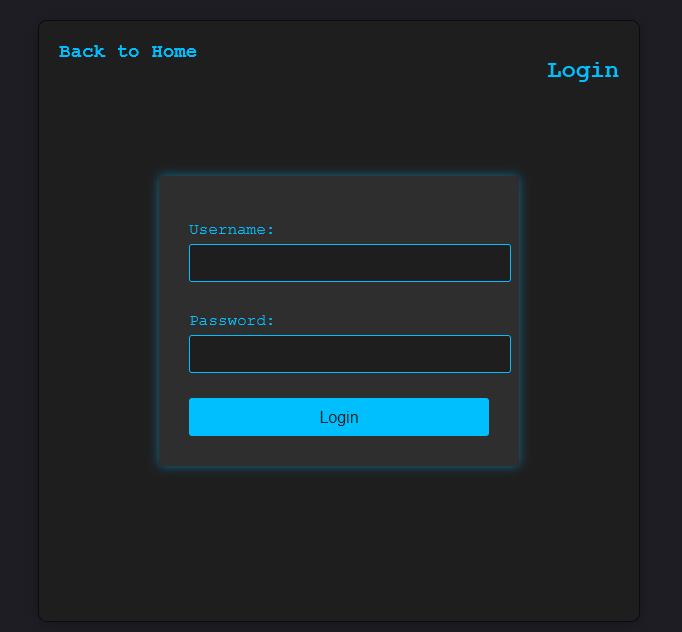
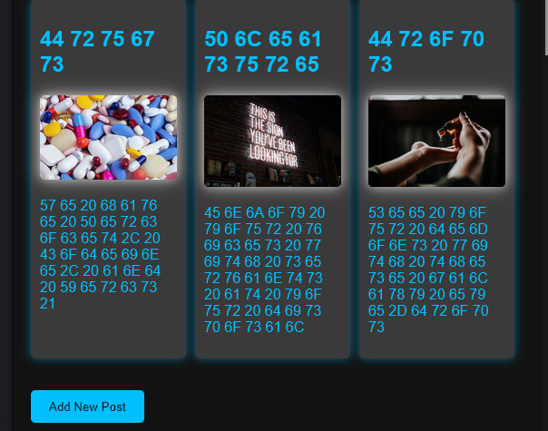
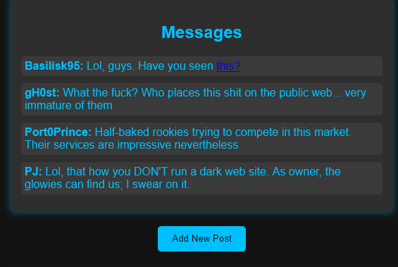
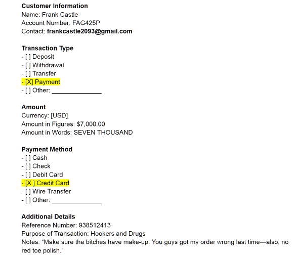
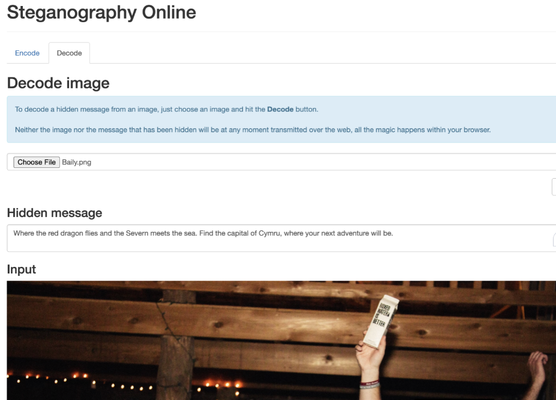

# Capstone-Project-Dark-Web-Investigation-Intelligence-Gathering

**Course:** *Introduction to Dark Web Operations*  
**Provider:** **Security Blue Team (SBT)**

---

## 📌 Project Overview

This capstone project simulates a **real-world dark web investigation** conducted in a **controlled training environment**.  
The objective was to infiltrate a TOR-based hidden service and gather **actionable intelligence** on individuals involved in **drug trafficking and related cybercrime activities**.

The project emphasizes **dark web reconnaissance, intelligence extraction, and OPSEC failure analysis** rather than exploitation.

---

## 🎯 Objectives

- Gain access to a restricted dark web service  
- Identify evidence of illegal drug trafficking  
- Discover locations and coordination points used by criminals  
- Extract intelligence hidden via encoding and steganography  
- Analyze operational security (OPSEC) failures  

---

## 🔍 Investigation Summary

### 1️⃣ Access & Authentication
- Analyzed client-side JavaScript using browser developer tools  
- Generated and decoded **Base64-encoded credentials**  
- Successfully authenticated to the hidden service  

---

### 2️⃣ Content & Post Analysis
- Decoded **hexadecimal-encoded** post titles  
- Identified pinned discussions related to:
  - **Drug distribution**
  - **Illicit pleasure services**
  - **Drop locations**

---

### 3️⃣ Criminal Network Identification
- Analyzed message board communications  
- Discovered references to a secondary illegal platform operated by the hacking group **_Midnite_**  
- Indicated collaboration between multiple criminal entities  

---

### 4️⃣ Financial Intelligence Exposure
- Investigated an exposed transaction log  
- Identified sensitive invoice information including:
  - Customer identity details  
  - Email address  
  - Purpose of transaction  
- Highlighted poor **OPSEC practices**

---

### 5️⃣ Steganography & Location Intelligence
- Extracted hidden data from an image posted by a suspect  
- Solved an embedded riddle revealing:
  - **City of an illegal gathering**
  - **Timing of the event**
- Demonstrated real-world attribution potential  

---

### 6️⃣ Illicit Marketplace Activity
- Decoded hexadecimal-encoded communications  
- Identified contact details of a user selling **stolen vehicle parts**

---

## 🛠️ Tools & Techniques Used

- **TOR Browser** & Dark Web Navigation  
- **Browser Developer Tools** (Console Analysis)  
- **CyberChef** (Base64 & Hex Decoding)  
- **Steganography Analysis**  
- **OSINT & Threat Intelligence**  
- **Criminal OPSEC Assessment**

---

## 🖼️ Screenshots

> ⚠️ *All screenshots are from a controlled training environment provided by Security Blue Team.*

### 🔐 Login & Console Analysis

### 🧵 Pinned Posts (Decoded Titles)

### 💬 Message Board & External Links

### 💰 Exposed Transaction Log

### 🕵️ Steganography Analysis

---

## ✅ Key Takeaways

- Dark web platforms often expose critical **OPSEC failures**  
- Encoded and steganographic data are frequently used to conceal intelligence  
- Proper analysis can enable **real-world attribution and intervention**  
- Skills align closely with **SOC Analyst**, **Threat Intelligence**, and **Cybercrime Investigation** roles  

---

## ⚠️ Disclaimer

> This project was completed **strictly in a controlled training environment** provided by **Security Blue Team (SBT)**.  
> No real-world systems or individuals were targeted.

---

## 📎 Tags

`dark-web` `threat-intelligence` `osint` `cybercrime` `steganography` `security-blue-team` `soc`

